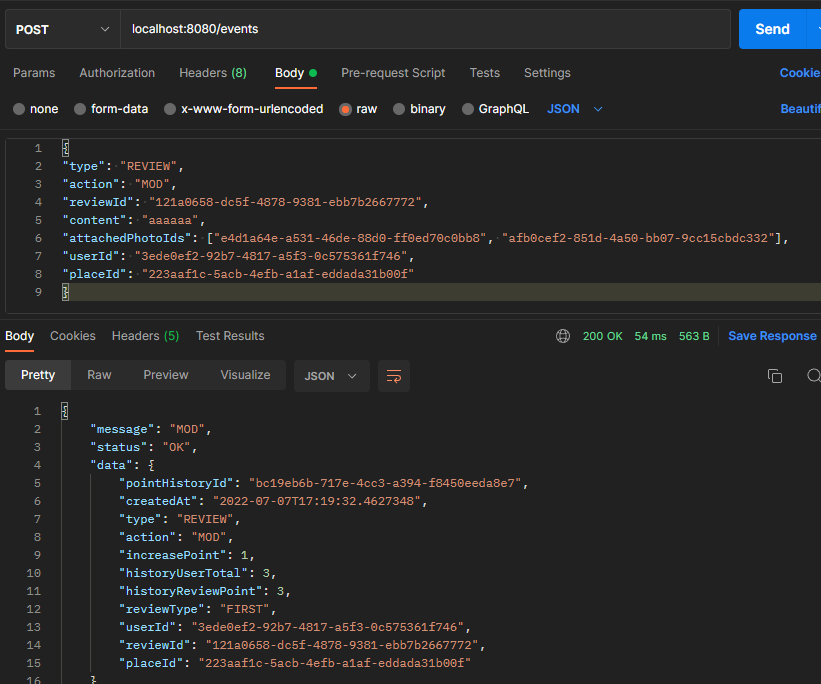

# 트리플 포인트 API
2022 트리플 공개채용 백엔드 사전과제

트리플여행자 클럽 마일리지 서비스

트리플 사용자들이 장소에 리뷰를 작성할 때 포인트를 부여하고, 전체/개인에 대한 포인트 부여 히스토리와 개인별
누적 포인트를 관리하고자 합니다.

[풀이 후 아쉬웠던 점](md/Note.md)

---

## 사용 기술

- Java 11
- Spring Boot 2.7.1
    - Spring Data JPA
- MySQL 8.0

---

## API

| Method | Url                    | Parameter     | Return                           | Description     |
|--------|------------------------|---------------|----------------------------------|-----------------|
| GET    | /events                |               | List\<PointResponse\>            | 전체 포인트 이력 조회    |
| GET    | /events/{userId}       | String userId | List\<PointResponse\>            | 사용자 포인트 이력 조회   |
| GET    | /events/{userId}/total | String userId | List\<TotalReviewPointResponse\> | 사용자 총 포인트 조회    |
| POST   | /events                |               | List\<PointResponse\>            | 포인트 이벤트 API     |

# 실행 방법
 
---

- application-db.yml 에서 MySQL username 과 password 를 설정
  - datasource 는 기본 3306 포트를 사용하고 database 명은 triple 을 사용하고 있습니다. 필요에 따라 변경해주세요
- createTable.sql 내 Table 생성 DDL 을 실행하여 각 Table 을 만들어 주시면 됩니다.
- PointApplication 을 실행합니다.
  - 테스트 : ./gradlew test 해 주시면 됩니다.
- API (/events) 요청을 하면 Data 를 확인할 수 있습니다.

- 실행 예시 화면
